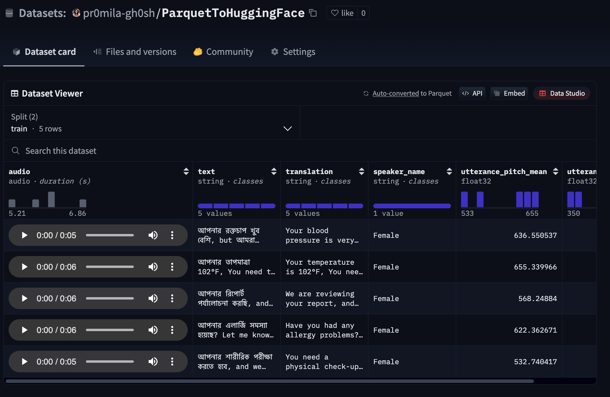

# ParquetToHuggingFace

This project processes audio data and creates Parquet files for uploading to Hugging Face. It uses the following two main scripts:

- **`create_parquet.py`**: This script is used to create Parquet files from raw audio data.
- **`upload_to_huggingface.py`**: This script uploads the Parquet files to Hugging Face, where they can be stored and shared.

## Table of Contents
- [1. Cloning the Repository](#1-cloning-the-repository)
- [2. Setting Up the Conda Environment](#2-setting-up-the-conda-environment)
- [3. Installing Dependencies](#3-installing-dependencies)
- [4. Setting Up Hugging Face Token](#4-setting-up-hugging-face-token)
- [5. Configuring the `config.yaml`](#5-configuring-the-configyaml)
- [6. Data Setup](#6-data-setup)
- [7. Running the Scripts](#7-running-the-scripts)
- [8. How the Code Works](#8-how-the-code-works)

## 1. Cloning the Repository

First, clone the repository to your local machine using the following command:

```bash
git clone https://github.com/your-username/ParquetToHuggingFace.git
cd ParquetToHuggingFace
```

## 2. Setting Up the Conda Environment

Create a new Conda environment to run the project:

```bash
conda create --name audio-parquet python=3.9
conda activate audio-parquet
```

## 3. Installing Dependencies

Install the necessary dependencies by using the `requirements.txt` file:

```bash
pip install -r requirements.txt
```

This will install all the required libraries and packages to run the project.

## 4. Setting Up Hugging Face Token

You need to set your Hugging Face token as an environment variable to upload data to Hugging Face. Run the following command in your terminal (replace `your_token_here` with your actual token):

```bash
export HUGGINGFACE_TOKEN='your_token_here'
```

You can find your Hugging Face token by visiting [Hugging Face - Account Settings](https://huggingface.co/settings/tokens).

To ensure the token persists across sessions, you can add the `export` command to your shell's configuration file (e.g., `~/.bashrc` or `~/.zshrc`).

## 5. Configuring the `config.yaml`

The `config.yaml` file stores the configuration for the paths and Hugging Face repository settings.

Make sure to update the `config.yaml` according to your local setup. Example:

```yaml
paths:
  base_data_directory: "/path/to/your/raw/data"
  output_directory: "/path/to/store/parquet"

huggingface:
  repo_id: "your_username/your_dataset_name"
  token_env_var: "HUGGINGFACE_TOKEN"
```

- `base_data_directory`: Path to your directory where the raw audio files and CSV files are located (it will be in the `raw data` directory).
- `output_directory`: Path to where the Parquet files will be saved (this will be in the `processed_data` directory).
- `repo_id`: Your Hugging Face repository ID where you want to upload the dataset.

## 6. Data Setup

Place your raw audio data and its corresponding CSV file into the `raw data` directory. The audio files should be in a format that the `create_parquet.py` script can read (e.g., `.wav` files).

Your directory structure should look like this:

```
ParquetToHuggingFace/
├── data/
│   ├── raw_data/
│   │   ├── test/
│   │   └── train/
│   └── processed_data/
├── config.yaml
└── src/
    ├── create_parquet.py
    └── upload_to_huggingface.py
```

## 7. Running the Scripts

### Step 1: Create Parquet Files

Run the following command to create the Parquet files from your raw audio data:

```bash
python3 src/create_parquet.py
```

This script will process the audio data in the `raw data` directory, calculate pitch statistics, and create the corresponding Parquet files in the `processed_data` directory.

### Step 2: Upload to Hugging Face

After the Parquet files are created, you can upload them to Hugging Face by running the following:

```bash
python3 src/upload_to_huggingface.py
```

This will upload the Parquet files from the `processed_data` directory to your Hugging Face repository.

## 8. How the Code Works

### `create_parquet.py`:
- This script reads the raw audio data and the CSV file containing information about the audio (e.g., transcription and translation).
- It calculates pitch statistics (mean and standard deviation) for each audio file.
- It then creates a Parquet file with the processed data (audio, transcription, translation, pitch statistics).
- The output is saved as Parquet files in the `processed_data` directory.

### `upload_to_huggingface.py`:
- This script logs you into Hugging Face using the token set in the environment.
- It checks whether the repository exists or needs to be created on Hugging Face.
- It then uploads the Parquet files from the `processed_data` directory to your Hugging Face repository.

---

### Final Outcome:
Once the scripts are successfully run, your data will be stored on Hugging Face as Parquet files, and you will have the ability to share and use them for various machine learning or research purposes.

### Screenshot of Final Outcome:
